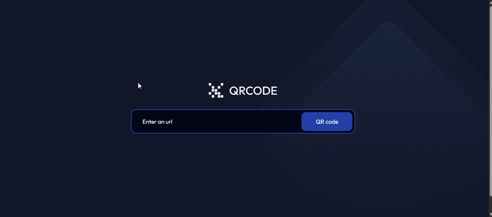

<h1 align="center">QR Code Generator | devChallenges</h1>

   Solução do desafio <a href="https://devchallenges.io/challenge/qa-code-generator" target="_blank">QR code generator </a> do site <a href="http://devchallenges.io" target="_blank">devChallenges.io</a>.

  <h3>
    <a href="https://hugo-moreira91.github.io/qr-code-generator/">
      Deploy
    </a>
     | 
    <a href="https://github.com/Hugo-Moreira91/qr-code-generator">
      Repositório
    </a>
     | 
    <a href="https://devchallenges.io/challenge/qa-code-generator">
      Desafio
    </a>
  </h3>

## Tabela de Conteúdos

- [Visão Geral](#visão-geral)
  - [O que aprendi](#o-que-aprendi)
  - [Recursos Úteis](#recursos-úteis)
- [Ferramentas Utilizadas](#ferramentas-utilizadas)
- [Funcionalidades](#funcionalidades)
- [Contato](#contato)
- [Conhecimentos](#conhecimentos)

## Visão Geral

Projeto que gera QR code a partir de uma URL inserida pelo usuário.

### O que aprendi 

1. Uso do pacote is-url-http para checar se a URL passada é válida ou não. URL's sem o protocolo http ou https são rejeitadas.
2. Uso do hook useNavigate() para direcionar o fluxo para a página seguinte, em caso de uma URL válida.
3. Uso do componente React qrcode.react para gerar QR code no formato SVG, bem como suas principais props para estilização direta.
4. Desenvolvimento de funções para download e compartilhamento do QR code gerado.
5. Uso do navigator, objeto nativo do JavaScript, em especial o share e o canShare - Web Share API
6. Serialização da imagem em uma string.
7. Criação de um objeto binário Blob, utilizado para manipular arquivos - no caso, a imagem do QR code gerada.
8. Gerando opções - caso não seja possível compartilhar a imagem do QR code, um link será utilizado para isso.  

### Recursos Úteis

- [is-url-http](https://www.npmjs.com/package/is-url-http): ajudou-me no entendimento de como funciona (retornos da função), bem como quais valores são válidos ou não.
- [qrcode.react](https://www.npmjs.com/package/qrcode.react): documento que trás instalação e uso da ferramenta de geração do QR code em si (formatos SVG ou Canvas). Além disso, mostra uma lista de props disponíveis para uso.
- [qrcode.react na prática](https://zpao.github.io/qrcode.react/): link que nos mostra, na prática e em tempo real, as alterações nas props e o que elas afetam esteticamente no QR code gerado.
- [react-router-dom](https://reactrouter.com/home): documentação oficial do React Router, para a criação das rotas do projeto.
- [styled-components](https://styled-components.com/docs): documentação de auxílio para a criação dos estilos de cada componente.

### Ferramentas Utilizadas

- HTML5
- Flexbox
- [Styled-components](https://styled-components.com/docs)
- [React](https://reactjs.org/)
- [React Router DOM](https://reactrouter.com/home)
- [Axios](https://axios-http.com/docs/intro)

## Funcionalidades

Ao clicar no botão correspondente, o download do QR code no formato SVG é realizado.

Ao clicar no botão Share, o compartilhamento do QR code pode ser realizado. Caso o navegador não suporte o compartilhamento da imagem, um link é gerado no lugar.

Esta aplicação foi desenvolvida graças ao desafio proposto no site [DevChallenges](https://devchallenges.io/challenges-dashboard).

## Conhecimentos

- [qrcode.react na prática](https://zpao.github.io/qrcode.react/): link que nos mostra, na prática e em tempo real, as alterações nas props e o que elas afetam esteticamente no QR code gerado.

## Autor

- GitHub [@Hugo-Moreira91](https://github.com/Hugo-Moreira91)
